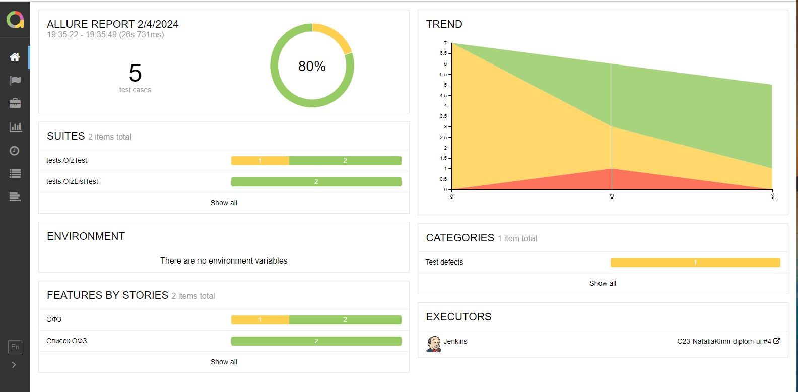
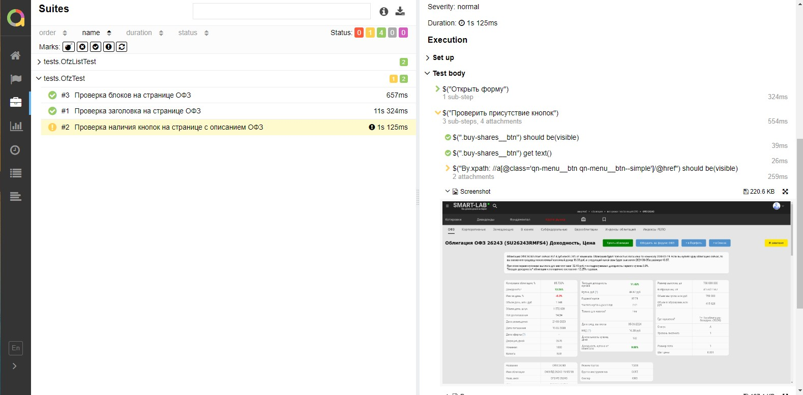
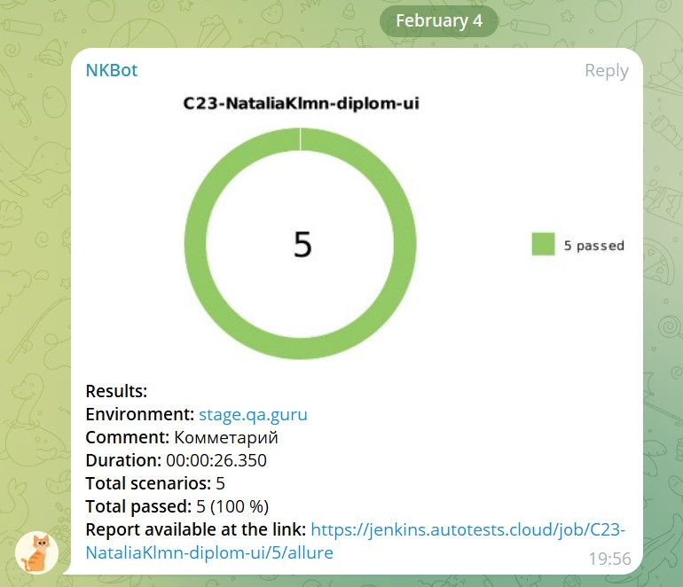
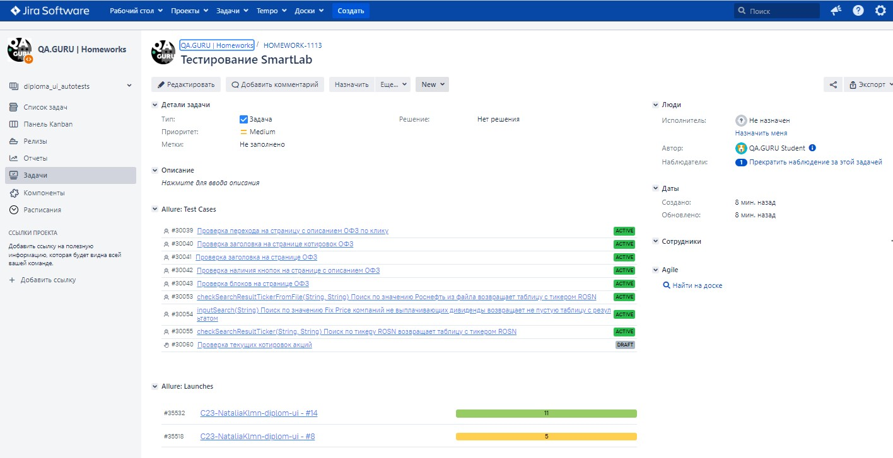

## Технологии и инструменты
Автотесты в этом проекте написаны на Java.\
<code>Gradle</code> — используется как инструмент автоматизации сборки.\
<code>JUnit5</code> — для выполнения тестов.\
<code>Jira</code> — для визуализации результатов тестирования.\
<code>Jenkins</code> — CI/CD для запуска тестов удаленно.\
<code>Allure Report</code> — для визуализации результатов тестирования.

## </a> [Allure Report](https://jenkins.autotests.cloud/job/C23-NataliaKlmn-diplom-ui/4/allure/) отчеты

### Основное окно

### Отчеты по тестам

> В отчете по тестам присутствует развернутая информация по запросам и ответам.

### Уведомление в Telegram с помощью бота

#### Содержание уведомления в Telegram

- [x] Окружение
- [x] Комментарий
- [x] Длительность прохождения тестов
- [x] Общее количество сценариев
- [x] Процент прохождения тестов
- [x] Ссылка на Allure отчет

### Интеграция с <a target="_blank" href="https://jira.autotests.cloud/browse/HOMEWORK-1113">Jira</a>

